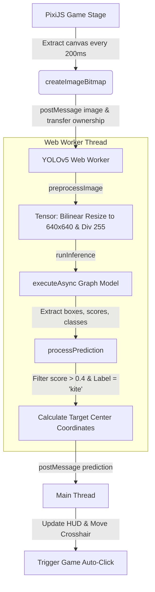

# Software Engineering & Applied AI — Postgraduate Portfolio

This repository contains practical examples and projects developed as part of the **Postgraduate Program in Software Engineering & Applied AI (Pós-Graduação em Engenharia de Software e Inteligência Artificial Aplicada)**. 

The projects demonstrate the application of modern software engineering methodologies—such as modular design patterns, asynchronous processing, and pipeline offloading—to the implementation of machine learning models and computer vision directly in the browser and server environments.

---

## 📂 Project Structure

```
software-engineering-and-applied-ai/
└── fundamentals-of-ai-and-llms-for-programmers /
    ├── example-00/                              # Basic Dense Neural Network Classification (Node.js)
    │   ├── index.js                             # Core model construction, training, and prediction
    │   └── package.json                         # Node dependencies (TensorFlow.js for Node)
    │
    ├── example-01-ecommerce-recomendations/     # E-commerce Recommendation System (Web)
    │   ├── index.html                           # Main storefront user interface
    │   ├── style.css                            # Clean, modern user interface styles
    │   ├── data/                                # Local datasets (users and products JSONs)
    │   ├── service/                             # Business logic and session handling
    │   └── README.md                            # Setup and features documentation
    │
    ├── example-02-vencendo-qualquer-jogo/       # AI-Powered Duck Hunt Game (Computer Vision)
    │   ├── src/                                 # Game source code (PixiJS rendering engine)
    │   ├── machine-learning/                    # Computer vision (YOLOv5) integration
    │   │   ├── main.js                          # AI main controller & canvas capture loop
    │   │   ├── worker.js                        # Multi-threaded Web Worker for YOLOv5 inference
    │   │   └── layout.js                        # HUD design for real-time predictions and statistics
    │   └── README.md                            # Detailed documentation on game mechanics & dependencies
    │
    ├── example-03-webai-01/                     # Basic Web AI Integration Demo
    │
    ├── example-04-webai02-temperature-and-topK/ # Web AI with Temperature & Top K Controls
    │
    └── example-05-webai03-multimodal/           # Multimodal Web AI (Image/Audio + Text)
```

> [!NOTE]
> Note the trailing space in the root folder name: `fundamentals-of-ai-and-llms-for-programmers `. When navigating or building, make sure to escape or wrap the folder name in quotes (e.g., `cd "fundamentals-of-ai-and-llms-for-programmers "`).

---

## 🚀 Projects Overview & Deep Dive

### 🧠 1. `example-00` — Neural Network Classification in Node.js
An introductory project designed to demonstrate the fundamentals of deep neural networks using **TensorFlow.js** on a server-side environment. 

- **The Task:** Categorize users into three distinct segments (`Premium`, `Medium`, `Basic`) based on their age, color preferences, and location.
- **Network Architecture:**
  - **Input Layer:** 7 nodes representing the normalized age and one-hot encoded categorical inputs (`[age_normalized, blue, red, green, São Paulo, Rio, Curitiba]`).
  - **Hidden Layer:** A dense layer with `80 units` utilizing the **ReLU** activation function. Relu functions act as a filter, allowing positive signals to propagate forward while dropping negative signals.
  - **Output Layer:** A dense layer with `3 units` representing the three target categories, normalized into probabilities using the **Softmax** activation function.
- **Training Configuration:** 
  - Compiled using the **Adam Optimizer** (Adaptive Moment Estimation) and **Categorical Crossentropy** loss.
  - Trained over `100 epochs` with data shuffling enabled to avoid bias.

---

### 🛒 2. `example-01-ecommerce-recomendations` — E-commerce Recommendation Flow
A dynamic web application showcasing a modern storefront where user interactions are tracked to build data pipelines for future machine learning recommendation systems.

- **The Flow:**
  1. Select a user profile from the database.
  2. View their demographic details and past purchases.
  3. Browse products, add items to the cart, and click **"Buy Now"**.
- **Data Capture:** All user interactions and buying behaviors are captured and stored in `sessionStorage` in real-time. This structural pattern isolates purchase history tracking, providing a clean data stream ready to be fed into recommendation algorithms (e.g., user similarity analysis and collaborative filtering models).

---

### 🦆 3. `example-02-vencendo-qualquer-jogo` — YOLOv5-Powered Duck Hunt AI
A high-performance implementation of the classic **Duck Hunt** game built on **PixiJS** (WebGL/Canvas rendering), supercharged with a real-time computer vision cheat agent that automatically detects and shoots targets.

#### ⚡ High-Performance Architecture
Running deep learning models (like YOLOv5) directly in the browser's main thread can cause frame drops and ruin the gaming experience. To keep rendering at a smooth 60 FPS, this project offloads all model preprocessing and inference to a **Web Worker**.



- **Inference Pipeline:**
  1. The **Main Thread** grabs a canvas bitmap of the current frame every `200ms` and posts it to the Web Worker, transferring the image ownership for zero-copy memory overhead.
  2. The **Web Worker** runs a custom-trained **YOLOv5n** graph model.
  3. The image is preprocessed (resized bilinearly to `640x640` and normalized to `[0, 1]`).
  4. The model detects bounding boxes and labels. The worker processes the results, filtering out any prediction below a **40% confidence threshold** and matching the specific target class (labeled as `kite` in this YOLO weight config).
  5. The target center coordinates are sent back to the main thread.
  6. The main thread repositions the crosshair and executes the shoot controller automatically!

---

### 🤖 4. `example-03-webai-01` — Minimal Web AI Integration
A simple vanilla HTML/JS application demonstrating the use of the `LanguageModel` API to generate responses directly in the browser.

---

### 🎛️ 5. `example-04-webai02-temperature-and-topK` — Prompt Tuning Web AI
A demonstration of parameter tuning in Web AI, allowing users to adjust `Temperature` and `Top K` via UI sliders to control the model's creativity and focus.

---

### 🎙️🖼️ 6. `example-05-webai03-multimodal` — Multimodal Web AI
An advanced demonstration of Web AI that supports multimodal inputs, allowing users to attach images or audio files along with text queries to get richer contextual answers directly in the browser.

---

## 🛠️ General Setup Instructions

To run these projects locally, you will need [Node.js](https://nodejs.org/) installed.

### Setting up `example-00`
1. Navigate to the folder:
   ```bash
   cd "fundamentals-of-ai-and-llms-for-programmers /example-00"
   ```
2. Install dependencies:
   ```bash
   npm install
   ```
3. Run the training and prediction demo:
   ```bash
   npm start
   ```

### Setting up `example-01-ecommerce-recomendations`
1. Navigate to the folder:
   ```bash
   cd "fundamentals-of-ai-and-llms-for-programmers /example-01-ecommerce-recomendations"
   ```
2. Install dependencies and start the static development server:
   ```bash
   npm install
   npm start
   ```
3. Open `http://localhost:8080` in your browser.

### Setting up `example-02-vencendo-qualquer-jogo`
1. Navigate to the folder:
   ```bash
   cd "fundamentals-of-ai-and-llms-for-programmers /example-02-vencendo-qualquer-jogo"
   ```
2. Install dependencies:
   ```bash
   npm install
   ```
3. Start the bundler and development server:
   ```bash
   npm start
   ```
4. Open `http://localhost:8080` to watch the AI automatically aim and shoot the ducks in real-time!

### Setting up Web AI Examples (03, 04, 05)
1. Navigate to the respective folder:
   ```bash
   cd "fundamentals-of-ai-and-llms-for-programmers /example-03-webai-01"
   # or example-04-webai02-temperature-and-topK
   # or example-05-webai03-multimodal
   ```
2. For examples 04 and 05, install dependencies and start the local development server:
   ```bash
   npm install
   npm start
   ```
3. Open the provided `localhost` link in your browser. Example 03 can be run directly by opening `index.html` in the browser or using a simple static server.

---

## 🎓 Key Learnings & Methodology
Through this postgraduate codebase, several critical advanced engineering concepts are demonstrated:
- **Client-Side vs. Server-Side ML:** Deploying models on Node.js vs. browser-optimized models.
- **Multi-threaded Web Applications:** Isolating computationally heavy neural network inference inside dedicated Web Workers using zero-copy transfers (`createImageBitmap`) to avoid blocking the main UI rendering thread.
- **Asynchronous Architecture:** Utilizing asynchronous rendering, event listeners, and ES6 modular design to decouple game engines from AI routines.
- **Input Normalization & Formatting:** Preprocessing raw features (demographics, raw image pixels) into structured, one-hot encoded, and floating-point normalized tensors that neural networks can parse.
